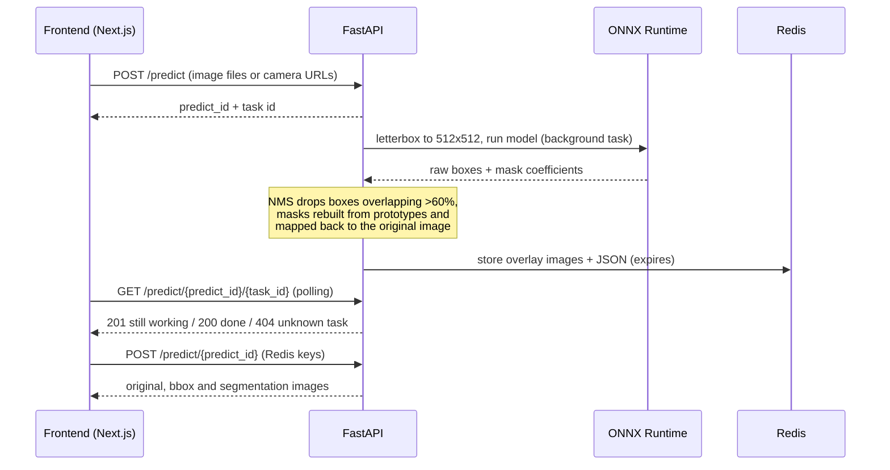

# CCTV Road Anomaly Detection

Finland publishes 802 camera images every 5 minutes from all over the country. This project runs a custom-trained segmentation model over those images to spot road surface damage (cracks, potholes), shows you exactly where the model found it, and lets you turn good detections into labelled training data for the next model. This full-stack app uses: a **Next.js, React, Typescript** frontend, a **FastAPI, Python** backend, and an exported graph-based **ONNX** a segmentation model, with **Redis** for short-lived prediction results and **PostgreSQL** for persistent/longterm user data.

**JQuery** is used for Rest Api polling logic for managing the request header codes for found prediction, processing users result and expired predictions state or possible error message. **Locust** is used to simulate a large virtual userbase to track 95% and 99% latency values on 9 REST API routes. Projects lines of .ts, tsx and .py code is 7 285 lines.

Onnx models predictions are turned to a annotation buffer data per detection and user inputted image is letterboxed to trainable model's parameters training image, leading to onnx image predictions being saveble as is as training data. Letterboxed training image is changed to png bytes,and validated using **Pydantic schema** annotation alongside of the annotations. Ann text is created from the combined coeffs/prototype masks resized to training image w and h, cropped to just contain masks pixels inside of the bounding box before being colored to black background and white segmentation mask, before being stored as a x,y and n pixel coordinates with a classname. 

Camera images come from Fintraffic's [Digitraffic](https://www.digitraffic.fi/en/road-traffic/) weather camera API.

## What you can do with it

- **Detect damage on a camera image.** Pick any of the 802 Fintraffic camera stations and choose an camera angle, or upload your own image as a file. You get back the original image, a bounding-box and a segmentation-mask for every detection, each with a classname and confidence score of the trained ONNX models prediction.
- **Label images yourself with SAM.** From a prediction image one can choose to further annotate the image further, draw bounding boxes of the damaged area, give each one a class colour specifying the type of damage found, and send for quick inference turning them into masks and YOLO-format annotation text files fit for storing as a dataset.
- **Keep your work.** Get a dashboard with all annotated images, and group them into named datasets ready for training.
- **Measure it.** Image pre-processing/encoding, ONNX Inference, post-processing containing segmentation mask & bounding box constructing, pixel coordinates for annotation files are timed recorded per run in milliseconds. Locust was used to gather p95 + p99 API latency metrics across the program. Predictions End-to-End time for one image containing two predictions was 3,000 ms for 95% and 3,400 ms for 99% of locust simulated users.

The model detects five classes: alligator crack, longitudinal crack, pothole, transverse crack and other unspecified corruption.

Training data behind the current model

521 images and 520 annotation files from six countries (China, Czech Republic, Norway, Japan, United States, India).

| Class              | Count | Share  |
| ------------------ | ----- | ------ |
| Longitudinal crack | 536   | 39.76% |
| Transverse crack   | 299   | 22.18% |
| Alligator crack    | 251   | 18.62% |
| Other corruption   | 133   | 9.87%  |
| Pothole            | 129   | 9.57%  |

## How it works

Predictions run as background tasks so the page never blocks on the model. The frontend gets an id straight away and polls until the result is ready.

| Piece         | What it does                                                                                              |
| ------------- | --------------------------------------------------------------------------------------------------------- |
| `frontend/`   | Next.js 16 / React 19 / TypeScript / Tailwind 4. TanStack Query polls predictions; NextAuth handles login. |
| `backend/app` | FastAPI app: Digitraffic proxy routes, auth and dataset routes, Postgres access, task manager.            |
| `backend/ml`  | Preprocessing (letterboxing), ONNX inference, post-processing, the SAM labeling endpoint. |
| Redis         | Holds prediction images and JSON for a short time, then they expire.                                      |
| PostgreSQL    | Users and their saved annotated images and datasets, load-test metrics from Locust.                                            |

## Views

view of users saved images.

Overview of quicker inference for interactive labelling tool for further specifying damages.  

Longer inference from custom trained segmentation model, showing one green alligator crack and a red longitude crack in the road.
